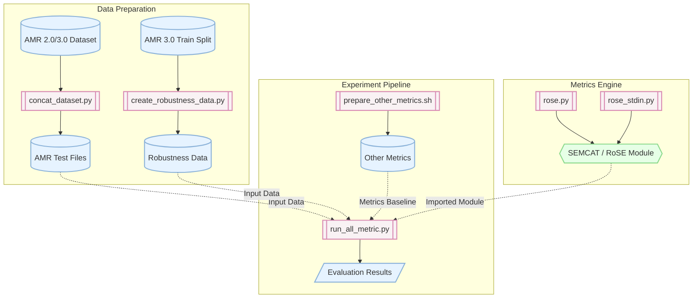

# Abstract Meaning Representation (AMR) Comparison Project

Dự án nghiên cứu về việc so sánh (AMR - Abstract Meaning Representation) Biểu diễn Ý nghĩa Trừu tượng.

AMR là một cấu trúc đồ thị có hướng được sử dụng để biểu diễn rõ ràng ý nghĩa của một câu trong ngôn ngữ tự nhiên dựa trên điều kiện đúng (truth-conditional semantics). AMR giúp máy tính hiểu được ý nghĩa logic của câu, bất kể cấu trúc từ vựng bề mặt ra sao, và thường được ứng dụng trong dịch máy, tóm tắt, hoặc phân tích câu hỏi.

Hiện dự án vẫn đang được phát triển bởi nhóm chúng tôi.

## Architecture Overview

Dưới đây là sơ đồ tổng quan về kiến trúc của dự án, mô tả cách thức hoạt động và tương tác giữa các thành phần (thư mục `metric` dùng cho tính toán độ đo và `experiment` dùng cho các thí nghiệm đánh giá):



## Getting Started

Để bắt đầu chạy dự án, bạn cần làm theo các bước dưới đây để tạo môi trường Conda và cài đặt các thư viện cần thiết.

### 1. Tạo môi trường Conda

Tạo và kích hoạt môi trường Conda mới (khuyến nghị Python 3.10):

```bash
# Tạo môi trường Conda
conda create -n amr_env python=3.10 -y

# Kích hoạt môi trường Conda
conda activate amr_env
```

### 2. Cài đặt các thư viện phụ thuộc

Cài đặt các thư viện từ `requirements.txt`, cài đặt thêm `anyascii` và nâng cấp `networkx>=3.1`:

```bash
# Cài đặt thư viện phụ thuộc chính
pip install -r requirements.txt

# Cài đặt thêm anyascii và nâng cấp networkx
pip install anyascii
pip install --upgrade "networkx>=3.1"

# (Nếu chạy thí nghiệm) Cài đặt bổ sung thư viện cho phần experiment
cd experiment
pip install -r requirements.txt
pip install anyascii
pip install --upgrade "networkx>=3.1"
cd ..
```

## Usage - Hướng dẫn chạy để ra kết quả

Dự án hỗ trợ nhiều cách chạy tùy thuộc vào nhu cầu sử dụng của bạn:

### 1. Tính toán độ đo tương đồng giữa 2 file AMR (RoSE Metric)

Sử dụng script `rose.py` ở thư mục gốc để tính toán độ tương đồng giữa file AMR tham chiếu (`ref.amr`) và file AMR giả thuyết (`hyp.amr`):

```bash
# Chạy tính toán với tham số khuyến nghị RoSE2-75 (N=2, Tau=0.75)
python rose.py -r ref.amr -p hyp.amr -n 2 -t 0.75

# Chạy tính toán với tham số khuyến nghị RoSE5-99 (N=5, Tau=0.99)
python rose.py -r ref.amr -p hyp.amr -n 5 -t 0.99

# Lưu kết quả điểm số từng câu ra file text
python rose.py -r ref.amr -p hyp.amr -n 5 -t 0.99 -o result.txt
```

*Ghi chú tham số:*
- `-r` / `--reference`: File chứa các đồ thị AMR chuẩn (Reference).
- `-p` / `--predicted`: File chứa các đồ thị AMR cần so sánh (Hypothesis/Predicted).
- `-n` / `--num-iterations`: Số vòng lặp WL algorithm (Khuyến nghị: `2` hoặc `5`).
- `-t` / `--similarity-threshold-tau`: Ngưỡng tương đồng (Khuyến nghị: `0.75` hoặc `0.99`).
- `-o` / `--output-txt`: File lưu kết quả chi tiết từng phần.

---

### 2. Chạy nhập dữ liệu AMR trực tiếp từ Terminal (Interactive)

Để kiểm tra nhanh 2 câu AMR bằng cách dán chuỗi trực tiếp:

```bash
python rose_stdin.py
```

---

### 3. Tính toán độ đo SEMCAT từ file kết quả CSV

Nếu bạn đã có file CSV điểm của các độ đo (ví dụ: `per-item.csv`), hãy chạy `calc_SEMCAT.py` để tổng hợp kết quả SEMCAT:

```bash
python calc_SEMCAT.py --in ./result/per-item.csv --out ./result/per-item_SEMCAT.csv --alpha 0.25
```

---

### 4. Chạy toàn bộ thí nghiệm đánh giá (Experiment Pipeline)

Nếu muốn tái tạo lại toàn bộ kết quả thí nghiệm trên các tập dữ liệu AMR 2.0 / 3.0:

```bash
cd experiment

# 1. Gộp dữ liệu kiểm thử (Test files)
python concat_dataset.py -i [AMR_test_files] -o [output_path]

# 2. Tạo dữ liệu đánh giá độ bền vững (Robustness data)
PYTHONHASHSEED=1 python create_robustness_data.py -r [AMR_3.0_Train_files] -o [output_path]

# 3. Chuẩn bị các độ đo đối chứng
./prepare_other_metrics.sh

# 4. Chạy đánh giá toàn bộ các độ đo để xuất ra kết quả
python run_all_metric.py -o ../result -c 4
```

---

### 5. Chạy giao diện Web App / API

Để khởi chạy giao diện Web tương tác:

```bash
uvicorn api.index:app --reload
```
Truy cập giao diện Web tại địa chỉ: `http://127.0.0.1:8000`
