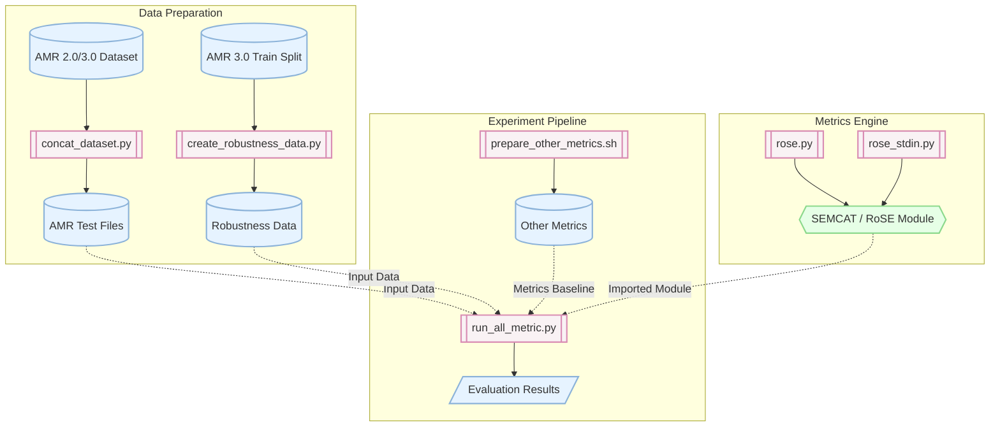

# Abstract Meaning Representation (AMR) Comparison Project

Dự án nghiên cứu về việc so sánh (AMR - Abstract Meaning Representation) Biểu diễn Ý nghĩa Trừu tượng.

AMR là một cấu trúc đồ thị có hướng được sử dụng để biểu diễn rõ ràng ý nghĩa của một câu trong ngôn ngữ tự nhiên dựa trên điều kiện đúng (truth-conditional semantics). AMR giúp máy tính hiểu được ý nghĩa logic của câu, bất kể cấu trúc từ vựng bề mặt ra sao, và thường được ứng dụng trong dịch máy, tóm tắt, hoặc phân tích câu hỏi.

Hiện dự án vẫn đang được phát triển bởi nhóm chúng tôi.

## Architecture Overview

Dưới đây là sơ đồ tổng quan về kiến trúc của dự án, mô tả cách thức hoạt động và tương tác giữa các thành phần (thư mục `metric` dùng cho tính toán độ đo và `experiment` dùng cho các thí nghiệm đánh giá):



## Getting Started

Để bắt đầu chạy dự án, bạn cần làm theo các bước dưới đây để cài đặt môi trường và các thư viện cần thiết.

### Requirements

Yêu cầu Python 3.x. Bạn cần cài đặt các thư viện phụ thuộc thông qua `pip`:

```bash
# Cài đặt thư viện cho phần độ đo (metric)
cd metric
pip install -r requirements.txt
cd ..

# Cài đặt thư viện cho phần thí nghiệm (experiment)
cd experiment
pip install -r requirements.txt
cd ..
```

## Usage

Dự án bao gồm 2 phần chính: **Metric** (đo lường độ tương đồng) và **Experiment** (thực hiện các thí nghiệm đánh giá). Dưới đây là hướng dẫn cách chạy từng phần.

### 1. Running Metric

Di chuyển vào thư mục `metric`. Bạn có thể sử dụng script `rose.py` để tính toán độ tương đồng giữa các đồ thị AMR.

```bash
cd metric

# Tính toán với tham số N=2 và Tau=0.75
python rose.py -r ref.amr -p hyp.amr -n 2 -t 0.75

# Tính toán với tham số N=5 và Tau=0.99
python rose.py -r ref.amr -p hyp.amr -n 5 -t 0.99
```

*Ghi chú các tham số:*
- `-r`: File chứa các đồ thị AMR tham chiếu (reference).
- `-p`: File chứa các đồ thị AMR giả thuyết/dự đoán (hypothesis/predicted).
- `-n`: Số vòng lặp tối đa cho thuật toán WL (Khuyến nghị: 2 hoặc 5).
- `-t`: Ngưỡng tương đồng (Khuyến nghị: 0.75 hoặc 0.99).

Bạn cũng có thể sử dụng `rose_stdin.py` (hoặc `stdin.py`) để đưa dữ liệu trực tiếp từ Standard Input.

### 2. Running Experiments

Di chuyển vào thư mục `experiment`. Đây là nơi chứa các mã nguồn để tái tạo lại kết quả thí nghiệm đánh giá trên các tập dữ liệu AMR.

Các bước thực hiện chính:

1. **Chuẩn bị dữ liệu:** Tải tập dữ liệu AMR 2.0 và AMR 3.0 từ LDC.
2. **Gộp dữ liệu kiểm thử (Test files):**
   ```bash
   python concat_dataset.py -i [AMR_test_split_files] -o [output_path]
   ```
3. **Tạo dữ liệu tính bền vững (Robustness data):**
   ```bash
   PYTHONHASHSEED=1 python create_robustness_data.py -r [AMR_3.0_Train_Split_files] -o [output_path]
   ```
4. **Chuẩn bị các độ đo khác để so sánh:**
   ```bash
   ./prepare_other_metrics.sh
   ```
5. **Chạy đánh giá toàn bộ độ đo:**
   ```bash
   python run_all_metric.py -o [OUTPUT_DIR] -c [NUM_CPUS]
   ```
   Để chạy nền và lưu danh sách lỗi ra file riêng, dùng lệnh:
   ```bash
   python run_all_metric.py -o [OUTPUT_DIR] -c [NUM_CPUS] 2>errors.log
   ```

*Để biết thêm chi tiết về các chức năng hoặc các cấu hình khác, bạn có thể tham khảo tệp `README.md` nằm trong từng thư mục con tương ứng (`metric/README.md` và `experiment/README.md`).*